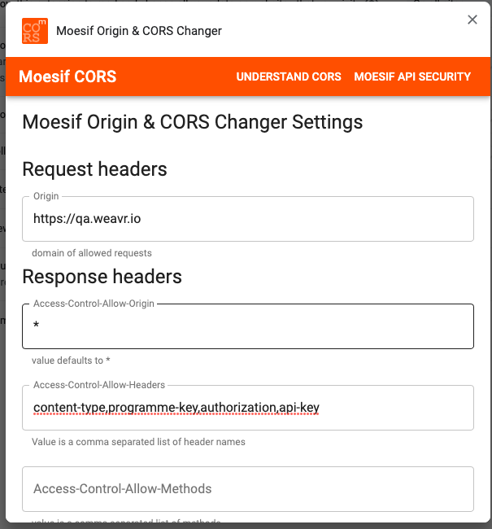
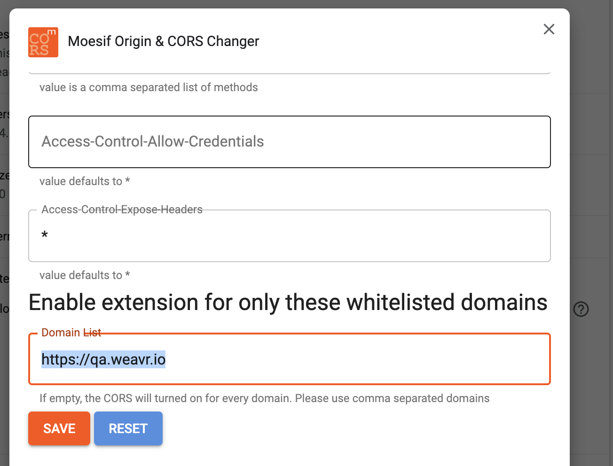

# UX Security Model

It is important to note that as a developemnt server we are VITE. VITE uses ESBuild for local development and uses Rollup for bundling.
ESBuild requires to used modern web browsers and consume script with `type="module"`. At the moment build releases are using traditional 
IIFE formats since ESM scripts are defered by default. 

For more information on Vite: https://vitejs.dev/

For more information on `async, dever vs module`: https://gist.github.com/jakub-g/385ee6b41085303a53ad92c7c8afd7a6#file-async-defer-module-md

---

## Development
### Install Locally

```
nvm use
```
```
npm i
```


### Run Locally
For local development one does not need to consume the script with SRI, since the development file will be continuously changed and therefore the hash will not match.
You do not need to rebuild sine we are using VITE HMR which will hot replace the module.

Consume the module via script using the following example below

```
    <script 
        type='module'
        src='http://localhost:8080/client/client.ts' 
        charset='utf-8'>
    </script>
```

```
npm run dev
```
Run script on local network. It is also important to update your .env.development `VITE_SECURE_LOCATION` with the IP of your machine

``
VITE_SECURE_LOCATION="http://172.16.1.153:8080/server/index.html"
``
```
npm run dev:host
```

### Run Sample App
#### Chrome Configuration 
Use [Moesif Origin & CORS Changer](https://chrome.google.com/webstore/detail/moesif-origin-cors-change/digfbfaphojjndkpccljibejjbppifbc?hl=en-US) chrome plugin with the below configuration 




``
cd sample
php -S localhost:3001
``
To launch example on local network use your machine IP and open up in browser.
``
php -S 172.16.1.153:3001
``

open `http://localhost:3001/`


### Build
To build and test a bundled version of the library. You would need to run the following
 
`npm run build`:
This will build and bundle the library using the build configuration. This will not generate any SRI.

`npm run preview`: This will host the bundled library from dist/ folder. You will need to change your
script tag to consume the bundled version.

```
    <script 
        src='http://localhost:8080/weavr-client-v2.js' 
        charset='utf-8'>
    </script>
```

`npm run release`: This will run both `npm run build` and `npm run release:sri`. This script is used to
release the full bundled version along with the SRI release notes found in release.yml. To consume and
test SRI you will need to update the script tag with SRI.

```
    <script
        src='http://localhost:8080/weavr-client-v2.js'
        integrity='sha384-F8cHGXI2kpHb3JrkynfRC6ZOwJPAEPrcBdvNdAJfQR20S4NGkkeou2ErnQ011KnF'
        crossorigin='anonymous'
        charset='utf-8'>
    </script>
```

`npm run release:sri`: This is only used to test and generate SRI and SRI release notes.
