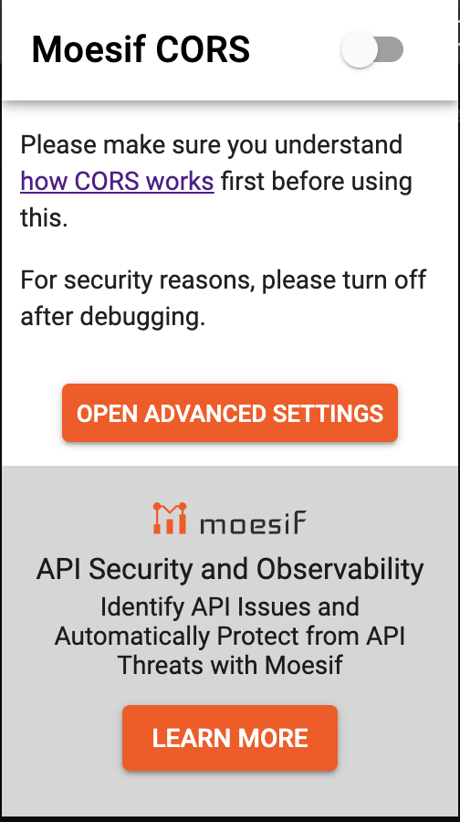

# Weavr Secure UX Components

## Running the sample

To run, open the ``index.html`` in a browser (ideally Chrome).
Once launched you will be able to see the integration documentation on the left. You will also notice a form
on the right that will allow you to initialise the UX Components in order to test them out.

Since you are running it locally in your browser, you will need to install a plugin to allow for Cross-Origin Requests.
One such plugin is Moesif CORS, available on both
[Chrome](https://chrome.google.com/webstore/detail/moesif-origin-cors-change/digfbfaphojjndkpccljibejjbppifbc) and
[Firefox](https://addons.mozilla.org/en-US/firefox/addon/moesif-origin-cors-changer1/).

Once installed, create and account if requested and then choose 'Open advanced settings'

Then configure the settings as below

| Parameter                    | Value                                    |
|------------------------------|------------------------------------------|
| Origin                       | https://qa.weavr.io                      |
| Access-Control-Allow-Origin  | *                                        |
| Access-Control-Allow-Headers | content-type,programme-key,authorization |
| Domain List                  | qa.weavr.io                              |

Leave the remaining fields as default and save

Finally go back to the `index.html` page, turn on Moesif CORS and proceed with setting the UI-Key
and the Username + Password or the Auth Key to initialise the UX Components.

## Developer Playground

In order to troubleshoot and contribute to the project a `playground.html` page was created, you are also required to
initialise the project as per above instructions. You are also free to customize and improve the playground in order to
facilitate in easier testing and development.

